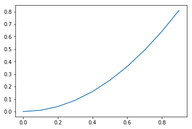
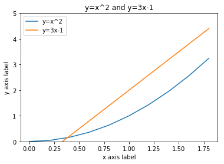
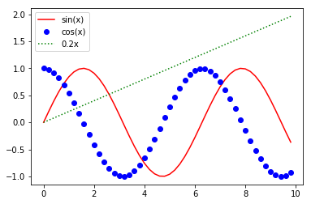
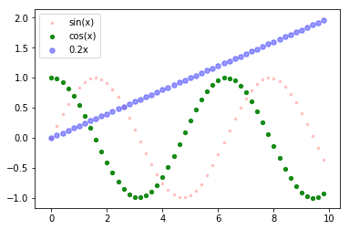
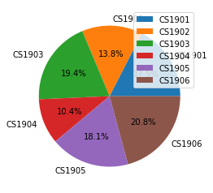
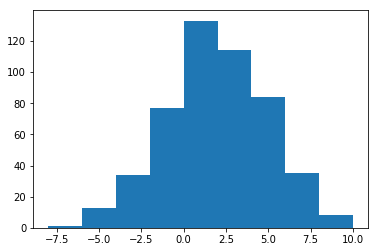
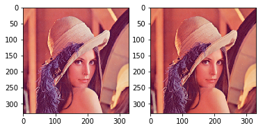

1小时学会Python ( Learning Python in an hour )

Python是一个动态类型的高级语言，所谓“动态类型”是指Python能自动从变量值推断其类型。可以用Python内置函数type()查询一个值的类型。如


```python
type(2)
```
int

```python
type(3.14)
```
    float

Python的print()函数可以输出一系列用逗号','隔开的对象，如：


```python
print(2,3.14,"http://hwdong.net",True)
print(type(2),type(3.14),type("http://hwdong.net"),type(False))
```
    2 3.14 http://hwdong.net True
    <class 'int'> <class 'float'> <class 'str'> <class 'bool'>
  
Python的bool类型只有2个逻辑值：True、False，分别表示真和假。Python的str类型表示字符串，字符串是多个字符构成的一个字符序列。Python用双引号或单引号包围一个字符序列表示一个字符串。如果一个字符串中内容占据多行，则用三引号'''包围来表示。如：

```python
print('''http://hwdong.net is
         a blog teaching computer programming''')
```
    http://hwdong.net is
             a blog teaching computer programming
    

Python的所有值都以对象形式表示，一个对象包含了值的：内容、类型、id（相当于地址）。如值10的内容是10，它的类型是int，可以用内置函数id()得到其id。

```python
id(10)
```

    140731301598304


### 变量

给一个对象其一个名字，叫做**变量**，一个对象可能被多次使用，通过变量名去访问这个对象可避免多次创建同样值得对象，另外还增加了代码得可读性。如：


```python
blog = "hwdong-net.github.io"
print(blog)
blog = "http://"+blog
print(blog)
```

    hwdong-net.github.io
    http://hwdong-net.github.io
    

Python的变量仅仅是对象的名字而不是对象本身，可以随时将同一个变量指向不同的对象。Python的变量仅仅是引用对象。而其他语言如C语言中，变量就是对象本身。


```python
a = 3.14              #a是对象3.14的引用
b = a                 #b和a引用同一个对象3.14
a = "hwdong-net.github.io"      #a引用了新的字符串对象"hwdong.net"
print(a)
print(b)
```

    hwdong-net.github.io
    3.14
    

可以用内置函数，将一种类型值转化为另外一种类型的值，如：


```python
a = int(3.14)
print(a)
print(type(a))
b= float("3.14")
print(b)
print(type(b))
```

    3
    <class 'int'>
    3.14
    <class 'float'>
    

Python内置函数input("提示串")可以用于从键盘输入一个字符串，可以给该函数传递一个提示串，在接受输入字符串，该函数先输出这个提示串。可以将输入的字符串用上述类型转换函数转换为某种类型的数据，如：


```python
score = input("请输入一个学生的分数：")
print(score)
```

    请输入一个学生的分数：78.9
    78.9
    

### 运算符

可以用运算符直接对（对象）值进行运算。不同类型的值支持的运算是不尽相同的。例如对数值类型（int、float）可以进行算术运算如+、-、```*```、/、%、//、```**```。其中%、//、```**```分别表示求余数、整数除、平方运算。如：


```python
x = 15
y = 2
print('x + y =',x+y)
print('x - y =',x-y)
print('x * y =',x*y)
print('x / y =',x/y)
print('x // y =',x//y)
print('x ** y =',x**y)
print('x % y =',x%y)
```

    x + y = 17
    x - y = 13
    x * y = 30
    x / y = 7.5
    x // y = 7
    x ** y = 225
    x % y = 1
    

Python的2个字符串可以用加法运算符+，产生的是一个拼接的新字符串，只能对用一个整数和一个字符串用乘法运算符，如：


```python
print("http:"+"//"+"hwdong.net") 
print("hello "*3)
```

    http://hwdong.net
    hello hello hello 
    

不能对2个字符串用乘法运算符或其他运算符如减法运算符。下列语句将出错。


```python
print("hello "*"world")
```


    ---------------------------------------------------------------------------

    TypeError                                 Traceback (most recent call last)

    <ipython-input-19-f3e4123ae63f> in <module>
    ----> 1 print("hello "*"world")
    

    TypeError: can't multiply sequence by non-int of type 'str'


对2个值进行比较的比较运算符==、!=、>、<、>=、<=分别表示等于、不等于、大于、小于、大于等于、小于等于。如：


```python
x = 15
y = 2
print('x > y is',x>y)
print('x < y is',x<y)
print('x == y is',x==y)
print('x != y is',x!=y)
print('x >= y is',x>=y)
print('x <= y is',x<=y)
```

    x > y is True
    x < y is False
    x == y is False
    x != y is True
    x >= y is True
    x <= y is False
    

逻辑运算符and、or、not分别表示**逻辑与**、**逻辑或**、**逻辑非**。在逻辑运算中，True或非0或非空对象就是真（True），而False或0或空对象就是假(Fasle)。运算运算符的运算规则是：
- 对一个对象x，当x是真 （True或非0值或非空值）时，not x就是False，当x是假（False或0或空值）时，not x就是True（真）。


```python
print(not 0)
print(not "")           
print(not False)
print(not 2)
print(not "hwdong")          
```

    True
    True
    True
    False
    False
    

- 对于2个对象x、y，当x是真时，x or y的结果就是x，当x是假时，x or y的结果就是y。


```python
print(3 or 2)      #因为3是真，3 or 2的结果就是3
print(0 or 2)      #因为0是假，0 or 2的结果就是2
print(False or True)
print(False or "")
print("" or 2)     #因为空字符串""是假，"" or 2的结果就是2
```

    3
    2
    True
    
    2
    

- 对于2个对象x、y，当x是真时，x and y的结果就是y，当x是假时，x and y的结果就是x。


```python
print(3 and 2)           #因为3是真，3 and 2的结果就是2
print(0 and 2)           #因为0是假，0 and 2的结果就是0
print(False and True)
print(True and "")
print("" and 2)          #因为空字符串""是假，"" and 2的结果就是{}
```

    2
    0
    False
    
    
    

Python还有移位运算符（如位与&、位或|、异或^、取反~、左移<<、右移>>）等其他运算符。有兴趣读者可以去搜索相关信息。

和C语言等编程语言不同，运算符=主要用于给一个变量起一个名字而不是修改一个变量的值。如：


```python
x=2       # 给对象2起了一个变量名x
x+=3      # 等价于 x= x+2,即变量名x指向了原来x引用的2和3相加的结果对象。
```

其中“x=2”给对象2起了一个变量名x，而“x+=3”是“x = x+3”的简写形式，即将变量名x指向了原来x引用的2和3相加的结果对象。可以看到运算符=和其他运算符结合如“x+=b”相当于“x = x+b”。运算符=可以和算术运算符和位运算符结合使用。如：
```
+=  -+   *=  /=   %=   **=  &=  |=  ^=  ~= <<= >>=  
```


```python
x=3
x**=2
print(x)
x%=2
print(x)
```

    9
    1
    

注意：python没有其他语言的自增运算符++和自减运算符--。

Python的成员运算符用于判断一个值（对象）是否在一个容器对象中。如：


```python
print("h"in"hwdong")
print("h"not in"hwdong")
```

    True
    False
    

身份运算符is和is not用于判断两个变量（标识符）是不是引用的同一个对象。


```python
a = 3.14
b = 3.15
c = a
print(id(a))
print(id(b))
print(a is b)
print(a is not b)
print(a is  c)
```

    1727166941440
    1727166941776
    False
    True
    True
    

### 对字符串进行操作

除前面的加法运算符+、```*```外，通常用一些处理字符串的内置函数或字符串类型str的方法对一个字符串进行处理。如：


```python
s = "http://Hwdong.Net"
print(s)                # 用print输出s引用的字符串内容
print(len(s))           # 用len()函数得到s引用的字符串的长度，即字符个数
print(s.capitalize())   #首字母大写
print(s.upper())        #所有字母大写
print(s.lower())        #所有字母小写
print(s.rjust(20))      #右对齐
print(s.center(20))     #中心对齐
print(s.replace('//', '//www.'))    #替换
print('  hwdong '.strip()+".net")   #裁剪
print(s)
```

    http://Hwdong.Net
    17
    Http://hwdong.net
    HTTP://HWDONG.NET
    http://hwdong.net
       http://Hwdong.Net
     http://Hwdong.Net  
    http://www.Hwdong.Net
    hwdong.net
    http://Hwdong.Net
    

注意，字符串对象是“不可以被修改的”，所有修改性操作实际返回的是一个新字符串，而原来的字符串并没有被修改！

还有可以在字符串里用格式符%来将一些数据格式化到字符串中，创建一个新字符串。如：


```python
s2 = '%s %s %f' % ("The score", "of LiPing is: ", 78.5)
print(s2)
```

    The score of LiPing is:  78.500000
    

也可以用字符串str的format()方法对一个字符串格式化，即将字符串中的占位符{}依次替换为format()方法中的数据。如：


```python
print ("{} {} {}".format("The score", "of LiPing is: ", 78.5)) 
```

    The score of LiPing is:  78.5
    

可以通过指定一个下标访问字符串的某个字符，下标从0开始，长度为n的字符串的下标为$0,1,2\cdots,n-1$，下标甚至可以是负整数，其中-1指的是最后一个字符，-n指的是第1个字符。


```python
s = "hwdong"
print(s[0], s[1], s[2], s[3], s[4], s[5])
print(s[-1],s[-5],s[-4],s[-3],s[-2],s[-1])
```

    h w d o n g
    g w d o n g
    

对于一个字符串s，```s[start:end:step]```表示创建一个从起始位置start开始，直到结束位置end，间隔步长为step的所有字符（不包括end位置的字符）构成的一个新字符串。如果没有指定step，则默认为1。如：


```python
s = "hwdong.net"
print(s[1:6:2])
print(s[-1:-6:-2])
print(s[1:6])
```

    wog
    tng
    wdong
    

### if语句

**if**关键字后面跟一个表示某种条件的表达式，当该表达式为True或非空值时，就执行if语句中的程序块。其格式如下：

```
if 表达式：
    程序块
```
如：


```python
score = 65.5
if score>=60:
   print("恭喜你!")
   print("通过了考试。")

```

    恭喜你!
    通过了考试。
    

**注意**:
- if 表达式后面要有冒号:
- Python中通过对齐方法表示一组语句属于同一个程序块，而其他语言如C、Java通常需要用一对{}包为统一程序块的语句。
        
Python中属于同一个程序块的代码如果正确的缩进，Python解释器会报错的。如：


```python
score = 65.5
if score>=60:
   print("恭喜你!")
  print("通过了考试。")
```


      File "<tokenize>", line 4
        print("通过了考试。")
        ^
    IndentationError: unindent does not match any outer indentation level
    


if和else可以结合使用，表示“如果...否则...”的意思。即当if中的条件表达式为True，则执行if子句中的程序块，否则执行else子句中的程序块。else后面不需要条件表达式。 其格式是：
```
if 表达式：
    程序块
else
    程序块2
```
如：


```python
score= int(input("请输入学生成绩："));
if score>=60:
    print("恭喜你!")
    print("通过了考试。")
else:
    print("你未通过考试。")
    print("继续努力，加油！")
```

    请输入学生成绩：45
    你未通过考试。
    继续努力，加油！
    

对于多个条件可以用if的另一种形式“if...elif...else”，即“如果...否则如果...否则”的意思。
```
if 表达式1:
   程序块1
elif 表达式2:
   程序块2
elif 表达式3:
   程序块3.
else:
   程序块k

```
如：


```python
score= int(input("请输入学生成绩："));
if score<60:
    print("不及格")
elif score<70:
    print("及格")
elif score<80:
    print("中等")
elif score<90:
    print("良好")
else:
    print("优秀");
```

    请输入学生成绩：79
    中等
    

### while语句

while语句的格式如下
```
while 表达式:
      程序块
```
即，当关键字while里的“表达式”为True，就重复执行其中的程序块。如：


```python
i = 1
s = 0
while i<=100:
   s = s+i;      #等价于  s += i
   i+=1
print(s)
```

    5050
    

再如，统计键盘输入的一组学生分数的平均分，可以用下列代码是实现：


```python
total_score=0
i= 0
score = float(input("请输入学生成绩："))
while True:
    total_score += score
    i += 1
    score = float(input("请输入学生成绩："))
    if  score<0:
        break                           #关键字break用于跳出循环   
    
print('平均成绩为：', total_score/i) 
```

    请输入学生成绩：45
    请输入学生成绩：78
    请输入学生成绩：93
    请输入学生成绩：-1
    平均成绩为： 72.0
    

在循环的程序块里嵌套了一个if条件语句，其中又有一个break关键表示的语句，表示跳出整个循环。

### for语句

for关键表示的也是一个循环语句，表示迭代访问一个容器对象中的每个元素。格式为：
```
for e in container:
    程序块
```
表示循环访问容器对象container中的每个元素e，执行其中程序块的语句。如：


```python
for ch in "hwdong":
    print(ch,end=" ")
```

    h w d o n g 

print()函数的参数end表示print()函数输出内容后的结束字符，默认是"\n"表示换行符，这里用空格符" "代替了"\n"。因此，输出ch后，print并没有换行，而是输出一个空格。

### Python常用容器类型

如同一个字符串是一些字符的容器一样，Python提供了list、tuple、set、dict等容器类型。

#### list（列表）

列表list是一组数据元素（对象）的有序序列，定义列表对象是用一对左右方括号```[ ]```包围、数据元素之间用逗号隔开。如：


```python
[1,2,3]
type([1,2,3])
```

list中的数据元素可以是不同的类型，甚至是包含其他对象的list对象，如：
```
[2, 3.14, 'python']
[2, 3.14,True,[3,6,9],'python']
```
和字符串一样，可以用一个下标访问（修改）其中的一个元素，也可以用```[start:end:step]```访问（修改）其中的多个元素。


```python
my_list =[2, 3.14,True,[3,6,9],'python']
print(type(my_list))  #打印my_list的类型，即list类型
print(my_list)
print("my_list[0]:",my_list[0])
print("my_list[3]:",my_list[3])
print("my_list[-2]:",my_list[-1])
print("my_list[:]:",my_list[:])        #所有元素
my_list[2:4] = [13, 9]
print(my_list)
```

    <class 'list'>
    [2, 3.14, True, [3, 6, 9], 'python']
    my_list[0]: 2
    my_list[3]: [3, 6, 9]
    my_list[-2]: python
    my_list[:]: [2, 3.14, True, [3, 6, 9], 'python']
    [2, 3.14, 13, 9, 'python']
    

当然可以用for循环等访问一个list对象中的元素。如：


```python
for e in my_list:
    print(e,end=" ")
```

    2 3.14 13 9 python 

甚至可以用for循环遍历一个容器或可迭代对象的方式来创建一个新的list对象。如：


```python
alist = [e**2 for e in [0,1,2,3,4,5]]
print(alist)
```

    [0, 1, 4, 9, 16, 25]
    

表示对```[1,2,3,4,5]```的每个元素e计算```e**2```，用这些值创建了一个list对象。python的一个内置函数range(n)是一个产生0到n之间整数（不包括n）的迭代器对象。下列代码可产生同样的结果：


```python
alist = [e**2 for e in range(6)]
print(alist)
```

    [0, 1, 4, 9, 16, 25]
    


```python
上述这种通过在[]中迭代计算产生值创建一个新list对象的式子，叫做“列表解析式”。其中还可以包括更加复杂的计算式子，如包含条件语句：
```


```python
alist = [0, 1, 2, 3, 4,5]
alist = [x ** 2 for x in alist if x % 2 == 0]
print(alist)  
```

    [0, 4, 16]
    

#### tuple（元组）

和list一样，tuple(元组)也是一组数据元素（对象）的有序序列，也就是每个元素也有唯一的下标。定义tuple是用圆括号而不是方括号。如：


```python
t = ('python',[2,5],37,3.14,"https://hwdong.net")
print(type(t))
print(t[1:4])
print(t[-1:-4:-1])
```

    <class 'tuple'>
    ([2, 5], 37, 3.14)
    ('https://hwdong.net', 3.14, 37)
    

list中的元素是可以修改的。


```python
print(alist)
alist[1] = 22
print(alist)
```

    [0, 4, 16]
    [0, 22, 16]
    

tuple中的元素是不可以被修改的，如同字符串中的元素是不可以被修改的。


```python
t[1]=22
```


    ---------------------------------------------------------------------------

    TypeError                                 Traceback (most recent call last)

    <ipython-input-142-70d00e4ef536> in <module>
    ----> 1 t[1]=22
    

    TypeError: 'tuple' object does not support item assignment


可以用()的解析式创建一个可迭代对象而不是tuple对象，如：


```python
nums = (x**2 for x in range(6))
print(nums) 
for e in nums:
    print(e,end= " ")
```

    <generator object <genexpr> at 0x00000192233DB8B8>
    0 1 4 9 16 25 

#### set（集合）

set是不包含重复元素的无序集合。set是用左右花括号{}包围的以逗号隔开的一组元素。元素的类型可以是不同的。如：


```python
s = {5,5,3.14,2,'python',8}
print(type(s))
print(s)
```

    <class 'set'>
    {2, 3.14, 5, 8, 'python'}
    

可以用add()和remove()函数向一个集合中添加和删除一个元素，而list对象可以用append()或insert()函数追加或插入元素，pop() 用于删除最后一个元素，remove()则是删除第一个指定值的元素。


```python
s.add("hwdong")
print(s)
s.remove("hwdong")
print(s)
alist.append("hwdong")
print(alist)
alist.insert(2,"net")
print(alist)
alist.pop()
print(alist)
alist.remove("net")
print(alist)
```

    {2, 3.14, 5, 'hwdong', 8, 'python'}
    {2, 3.14, 5, 8, 'python'}
    [0, 22, 16, 'hwdong']
    [0, 22, 'net', 16, 'hwdong']
    [0, 22, 'net', 16]
    [0, 22, 16]
    

但不可修改对象如tuple则没有append()或insert()之类的函数用于添加元素。下列代码是错误的：


```python
t.append("hwdong")
```


    ---------------------------------------------------------------------------

    AttributeError                            Traceback (most recent call last)

    <ipython-input-133-34fd50c7f43a> in <module>
    ----> 1 t.append("hwdong")
    

    AttributeError: 'tuple' object has no attribute 'append'


```python
可以用{}的解析式创建一个set对象，如：
```


```python
nums = {x**2 for x in range(6)}
print(nums) 
```

    {0, 1, 4, 9, 16, 25}
    

#### dict（字典）

dict是一个 (key-value pairs) “键-值”对的无序集合。每个元素都以“键:值(key:value)”的形式存储的。如：


```python
d = {1:'value', 'key':2, 'hello': [4,7]}
print(type(d))
print(d)
```

    <class 'dict'>
    {1: 'value', 'key': 2, 'hello': [4, 7]}
    

需要通过key(键，也称为关键字)才能访问dict中这个key对应元素的值value。如：


```python
d['hello']
```


    [4, 7]


如果一个key对应的元素不存在，通过这个key访问元素是非法的，如：


```python
d[3]
```


    ---------------------------------------------------------------------------

    KeyError                                  Traceback (most recent call last)

    <ipython-input-156-0acadf17a380> in <module>
    ----> 1 d[3]
    

    KeyError: 3


但可以给一个不存在的key赋一个值（value），将在这个set中添加一个“键-值”对的元素。如：


```python
d[3] = "python"
print(d)
print(d[3])
```

    {1: 'value', 'key': 2, 'hello': [4, 7], 3: 'python'}
    python
    

可以定义一个表示学生信息并以名字作为关键字的dict对象：


```python
students={"LiPing":[21,"计科01",15370203152],"ZhangWei":[20,"计科02",17331203312]
         ,"ZhaoSi":[22,"机械03",16908092516]}
print(students)
print(students["ZhangWei"])
```

    {'LiPing': [21, '计科01', 15370203152], 'ZhangWei': [20, '计科02', 17331203312], 'ZhaoSi': [22, '机械03', 16908092516]}
    [20, '计科02', 17331203312]
    

可以通过for...in循环语句访问字典中的元素，如：


```python
for name in students:
    info = students[name]
    print('{}\'s info: {} '.format(name, info))   
```

    LiPing's info: [21, '计科01', 15370203152] 
    ZhangWei's info: [20, '计科02', 17331203312] 
    ZhaoSi's info: [22, '机械03', 16908092516] 
    

注意：单引号'的字符串中不能直接包含单引号'需要用反斜杠字符\和单引号'构成的转义字符表示单引号字符'。在双引号字符"的字符串中包含双引号字符，则也需要用转移字符\"。

上述for循环中的name表示的是字典对象的key（键），如果向同时获得键（key）和值（value），则可以用dict类的item()方法获得一个字典对象的所有键-值：


```python
for key,value in students.items():
    value = students[key]
    print('{}\'s info: {} '.format(key,value)) 
```

    LiPing's info: [21, '计科01', 15370203152] 
    ZhangWei's info: [20, '计科02', 17331203312] 
    ZhaoSi's info: [22, '机械03', 16908092516] 
    

当然，也可以用一个{}解析式创建一个字典对象，如：


```python
points = {x:x**2 for x in range(6)}
print(points) 
```

    {0: 0, 1: 1, 2: 4, 3: 9, 4: 16, 5: 25}
    

### 函数

Python通过关键字def定义函数，给一个程序块起一个名字，然后就可以通过函数名去调用执行这个函数块中的代码。

下面的代码首先用关键字import导入了数学函数库math，其中有一个表示PI的常量math.pi，然后定义了一个函数名是circle_area的函数，此后，可以通过函数名circle_area调用上面的circle_area()函数。


```python
#定义一个函数名是circle_area的函数
import math             #导入数学函数库math，其中有一个表示PI的常量math.pi
def circle_area():
    area = math.pi*2.5**2
    print("半径是2.5的圆面积是：%f"%area)    

circle_area()    #通过函数名circle_area调用上面的circle_area()函数
```

    半径是2.5的圆面积是：19.634954
    

函数名后面的()里是函数的参数，调用该函数的代码可以将相应的数值传给对应的函数参数。如给上面函数添加一个表示半径的参数r。在调用时，也必须提供实际数值给这个参数r。


```python
import math             
def circle_area(r):
    area = math.pi*r**2
    print("半径是%5.2f的圆面积是：%5.2f"%(r,area))    #格式符%5.2f表示输出的是float类型的数，占据5位宽，小数点后是2位

circle_area(2.5)    #通计算半径是2.5的圆面积
circle_area(3.5)    #通计算半径是3.5的圆面积
```

    半径是 2.50的圆面积是：19.63
    半径是 3.50的圆面积是：38.48
    

函数内部可以通过return返回，即结束函数的执行，return还可以返回一些数值。如：


```python
import math             
def circle(r):
    area = math.pi*r**2
    perimeter = 2*math.pi*r
    return area,perimeter    

area,p = circle(2.5)   
print("半径是2.5的圆面积和周长是：%5.2f,%5.2f"%(area,p))
area,p =circle(3.5)   
print("半径是3.5的圆面积和周长是：%5.2f,%5.2f"%(area,p))
```

    半径是2.5的圆面积和周长是：19.63,15.71
    半径是3.5的圆面积和周长是：38.48,21.99
    

函数的参数可以有默认值，如果调用函数时，没有提供相应的参数。


```python
def pow(x,n=2):
    ret = 1
    for i in range(n):
        ret *=x
    return ret

print(pow(3.5))
print(pow(3.5,3))        
```

    12.25
    42.875
    

定义函数时，默认参数必须排在非默认参数的后面。下面函数定义是错误的。


```python
def pow(a,b=2,c):
    return a+b+c
```

一个函数内部可以存在调用其他函数的语句，函数也可以作为另外函数的参数。

下面的函数solve_iterative()用于求f(x)=y的方程的根，参数lower、 upper是求解区间的左右端点，参数f可以接受一个函数，参数y是一个数值。假设f表示的是一个单挑递增的函数，函数solve_iterative()采用二分法去计算区间中点middle的值f(middle)是否和y足够接近。如果没有，则在左半区间或右半区间重复这个过程。

函数area()计算半径r的圆面积，最后调用solve_iterative()去求半径0.5和0.6之间圆面积为1的那个圆的半径是什么？


```python
import math   
def solve_iterative(f, y, lower=0, upper=1):
    middle = (lower + upper) / 2
    while math.fabs(f(middle) - y) >= 1e-6:
        print("lower:", lower, "upper:", upper)
        if f(middle) < y:
            lower = middle
        else:
            upper = middle        
        middle = (lower + upper) / 2
    return middle

def area(r):    
    return (r ** 2) * math.pi

print("0.5和0.6之间圆面积为1的那个圆的半径是:", solve_iterative(area, 1, 0.5, 0.6))
```

    lower: 0.5 upper: 0.6
    lower: 0.55 upper: 0.6
    lower: 0.55 upper: 0.575
    lower: 0.5625 upper: 0.575
    lower: 0.5625 upper: 0.56875
    lower: 0.5625 upper: 0.565625
    lower: 0.5640625 upper: 0.565625
    lower: 0.5640625 upper: 0.5648437500000001
    lower: 0.5640625 upper: 0.564453125
    lower: 0.5640625 upper: 0.5642578125
    lower: 0.56416015625 upper: 0.5642578125
    lower: 0.56416015625 upper: 0.564208984375
    lower: 0.5641845703125 upper: 0.564208984375
    lower: 0.5641845703125 upper: 0.56419677734375
    lower: 0.5641845703125 upper: 0.564190673828125
    lower: 0.5641876220703126 upper: 0.564190673828125
    lower: 0.5641891479492188 upper: 0.564190673828125
    0.5和0.6之间圆面积为1的那个圆的半径是: 0.5641895294189454
    

当然，一个函数可以在其内部调用自身，这种函数称为递归函数。下面求一个正整数n的阶乘的函数，当n=1时，直接返回1，否则将 n!转化为n*(n-1)!的问题。


```python
def fact(n):
    if n==1:             #如果n等于1，就直接返回值1
        return 1
    return n * fact(n - 1)  #如果n大于1，就是n和fact(n-1)的乘积
fact(4)             # 输出： 24
```


    24


作为练习，读者可以尝试将上面的求方程f(x)=y根的函数写成递归函数的形式。

### 类

类(class)是对一个抽象概念的描述，它描述了属于同一个概念的所有对象的共同属性，这些属性有：数据属性和方法属性。数据属性描述了该类对象的状态，而方法属性描述了该类对象具有哪些功能。一个类就是一个数据类型，它刻画了这种类型的所有可能值的的共同属性，如int类型刻画了所有整数的特性。

前面的str、list等都是类。一般的，可以通过类名创建一个类对象，类对象是一个具体的对象。如：


```python
s = str("http://hwdong.net")
location = s.find("hwdong")     #通过str的find()方法查询是否存在一个子串，返回子串的位置
print(location)
alist = list(range(6))
blist = alist.copy()
blist[2] = 20
print(alist)
print(blist)
```

    7
    [0, 1, 2, 3, 4, 5]
    [0, 1, 20, 3, 4, 5]
    

可以看到，可以通过一个类对象用“成员访问运算符.”访问类的方法，对这个对象执行某种操作（访问某些信息或修改该对象或创建新对象）。例如，s.find()在s中查询是否存在一个子串，返回子串的位置。而alist.copy()复制创建了一个和alist一样内容的list对象并使blist引用这个新创建的list对象。

Python中用关键字class定义一个类。为了刻画所有学生的共同属性，可以定义一个Student类。


```python
class Student:
    def __init__(self, name, score):
        self.name = name
        self.score = score
        
    def print(self):
        print(self.name,",",self.score)
```

类中的函数称为方法，通过一个类对象调用一个类的方法，就可以对这个类对象进行各种操作，因为一个类的对象可以右很多个，类的方法一般只对一个具体对象进行操作，因此，一般的方法的第一个参数都是self，表示调用这个类方法的是哪个对象。

下面代码定义了Student类的2个对象s1和s2：并通过它们调用了类Student的print()方法。Student的print()方法又调用了内置的函数print()输出self指向对象的姓名和分数。


```python
s1 = Student("LiPing",67)
s2 = Student("WangQiang",83)
s1.print()
s2.print()
```

    LiPing , 67
    WangQiang , 83
    

类的中__init__()是一个特殊方法，称为**构造函数**，在定义类的对象时，会自动调用这个构造函数，对self指向的类对象进行初始化。如定义了2个类对象属性name和score并用构造函数的参数对它们进行初始化。

每个对象都有自己单独的实例属性，改变一个对象的实例属性不会影响其他对象的实例属性。除了实例属性外，还可以给一个类定义类属性，类属性是类的所有对象都共享的属性。类属性是定义在类的方法外面的属性。

如修改的Student类添加了一个类属性count，表示从这个类创建了多少具体的类对象，其初始值为0，每当创建一个类对象时，就增加其计数。


```python
class Student:
    count=0
    def __init__(self, name, score):
        self.name = name
        self.score = score
        Student.count +=1
        
    def print(self):
        print(self.name,",",self.score)
```

一般的都是通过“类名.类属性”来查询或修改类属性，如“Student.count”，也可通过“实例名.类属性”（包括self.类属性）来查询实例属性。如下面的s1.count。


```python
print(Student.count)
s1 = Student("LiPing",67)
print(s1.count)
s2 = Student("WangQiang",83)
print(Student.count)
```

    0
    1
    2
    

### Matplotlib
Matplotlib是一个Python语言的2D绘图库，windows系统下以管理员权限打开命令行窗口，然后执行下列命令安装它。
```
pip install matplotlib
```
Linux或Mac可以需要管理员权限，即执行：
```
sudo pip install matplotlib
```
matplotlib的pyplot模块提供了简单的绘图函数，可以用下面的代码导入matplotlib.pyplot模块并命名为plt，可避免在代码中写一长串的matplotlib.pyplot。


```python
import matplotlib.pyplot as plt
```

pyplot模块的plot()函数可以直接绘制2D数据，如：


```python
y = [i for i in range(10)]
print(y)
plt.plot(y)           #  绘制y作为纵轴坐标点构成的图形
plt.show()            #  调用plt.show()显示图形
```

    [0, 1, 2, 3, 4, 5, 6, 7, 8, 9]
    


尽管只给了纵轴坐标的数组y，plot()函数默认会自动生成从0开始的横轴坐标。当然，可以分别传递2个数组表示x和y坐标，如：


```python
x = [i*0.1 for i in range(10)]
y = [xi**2 for xi in x]
print(["{0:0.2f}".format(i) for i in x])
print(["{0:0.2f}".format(i) for i in y])
plt.plot(x, y)        #  绘制(x,y)坐标点构成的图形
plt.show()            #  调用plt.show()显示图形
```

    ['0.00', '0.10', '0.20', '0.30', '0.40', '0.50', '0.60', '0.70', '0.80', '0.90']
    ['0.00', '0.01', '0.04', '0.09', '0.16', '0.25', '0.36', '0.49', '0.64', '0.81']
    





可以同时绘制几个曲线。


```python
x = [i*0.2 for i in range(10)]
y = [xi**2 for xi in x]
y2 = [3*xi-1 for xi in x]

plt.plot(x, y)        #  绘制(x,y)坐标点构成的图形
plt.plot(x, y2)  
plt.ylim(0,5)
plt.xlabel('x axis label')
plt.ylabel('y axis label')
plt.title('y=x^2 and y=3x-1')
plt.legend(['y=x^2', 'y=3x-1'])
plt.show()            #  调用plt.show()显示图形
```





其中pyplot模块的函数title()用于给图起一个标题，而legend()则给每个绘制的曲线一个名字，xlim()和ylim()用于限定x和y坐标的范围，xlabel()和ylabel()用于给x轴和y轴一个标签。可以看到不同的图形将自动用不同的颜色显示。

plot()函数还可以接受一些参数，用于定制绘制的图形的样式，如：


```python
import math
x = [i*0.2 for i in range(50)]
y = [math.sin(xi) for xi in x]
y2 = [math.cos(xi) for xi in x]
y3 = [0.2*xi for xi in x]
plt.plot(x, y,'r-')        
plt.plot(x, y2,'bo')  
plt.plot(x, y3,'g:')  
plt.legend(['sin(x)', 'cos(x)','0.2x'])
plt.show()           
```





其中'r-'的r表示红色（red）、-表示短线，'bo'的b表示蓝色（blue）、o表示以圆点，'g:'的g表示绿色（green）、:表示虚线。

pyplot模块除了plot()函数可以绘图外，还有其他的一些函数用于绘制其他类型的图，如 scatter()用于绘制散乱点图。如：


```python
import math
x = [i*0.2 for i in range(50)]
y = [math.sin(xi) for xi in x]
y2 = [math.cos(xi) for xi in x]
y3 = [0.2*xi for xi in x]
plt.scatter(x, y, c='r', s=6, alpha=0.2)        
plt.scatter(x, y2,c='g', s=18, alpha=0.9)  
plt.scatter(x, y3,c='b', s=30, alpha=0.4)  
plt.legend(['sin(x)', 'cos(x)','0.2x'])
plt.show() 
```





其中参数c表示颜色，其值'r'、'g'、'b'分别表示红、绿、蓝，s参数表示点的大小，alpha表示图的透明性。

bar()函数用来绘制条形图。条形图常常用来描述一组数据的对比情况。如下面代码用bar()函数计科6个班级的平均分数：


```python
classes=['CS1901','CS1902','CS1903','CS1904','CS1905','CS1906']
scores = [76.5, 60.5, 85.0,45.5,79.3,91]
plt.bar(classes, scores, color='green')   #color参数表示颜色，'green'表示绿色
plt.xlabel('班级名')
plt.ylabel('平均分')
plt.show() 
```


pie()函数用来绘制饼状图。饼状图通常用来表达集合中各个部分的百分比。下面代码将上述的scores以百分比的饼状图形式显示，其中的labels是这些百分比对应的标签。legend()函数用参数loc指定在右上角'upper right'显示这些标签。


```python
classes=['CS1901','CS1902','CS1903','CS1904','CS1905','CS1906']
scores = [76.5, 60.5, 85.0,45.5,79.3,91]
plt.pie(scores,labels = classes, autopct='%1.1f%%')
plt.legend(loc='upper right')
plt.show() 
```





hist()函数用来绘制直方图。直方图看起来是条形图有些类似。但它们的含义是不一样的，直方图描述了数据中某个范围内数据出现的频度。


```python
import random
data=[random.normalvariate(2, 3) for i in range(500)]
bins = [-8, -6, -4,-2,0,2,4,6,8,10]
plt.hist(data, bins=bins)
plt.show()
```





可以看到在bins数组表示的不同范围里的数据点个数是不一样的，```[-8,-6]```个数很少，而```[0,2]```和```[2,4]```范围的数据点个数很多。直方图以条形图形式直观显示了每个区间的数据点个数。

显示图形的窗口figure对象除了可以显示多个图形外，

还可以用多个子区域来显示不同的图形。可以用subplot()函数指定子图绘制在那个子图窗口中。
```
subplot(numRows, numCols, plotNum)
```
其参数numRows, numCols, plotNum分别指定行数、列数和子图的序号。在绘制子图中的图形前，先调用subplot()指明在那个位置的子图上绘制图形，并可以用title()函数设置子图的标题。如：


```python
import math
x = [i*0.2 for i in range(50)]
y = [math.sin(xi) for xi in x]
y2 = [math.cos(xi) for xi in x]
y3 = [0.2*xi for xi in x]

fig = plt.gcf()
fig.set_size_inches(12, 4, forward=True)

plt.subplot(1, 2, 1)
plt.plot(x, y,'r-') 
plt.plot(x, y2,'bo')  
plt.title('sin(x) and cos(x)')
plt.legend(['sin(x)', 'cos(x)'])

plt.subplot(1, 2, 2)
plt.plot(x, y3,'g:')  
plt.title('0.2x') 


plt.show()    
```


上述代码，先通过```fig = plt.gcf()```得到当前绘图窗口的figure对象并赋值给遍历fig，然后通过调用figure的set_size_inches()函数修改默认的figure对象的宽高，forward=True表示立即更新当前窗口的figure对象大小。

可以用imshow()显示一幅图像，在这之前可以用skimage库的io模型的imread()函数读取图像。读取的图像放在一个多维数组库numpy的多维数组ndarray对象中。numpy模型可以有很多方便的函数处理多维数组，如uint8()函数可以将其他数据元素类型的numpy数组转化为uint8类型即无符号整数类型（取值范围是```[0,255]```），也可用运算符```*```进行逐元素的乘积。


```python
import numpy as np
import skimage 
import matplotlib.pyplot as plt

img = skimage.io.imread('imgs/lenna.png')    #原图
img_tinted = img * [1, 0.95, 0.9]    #3个颜色通道值乘以不同的系数

plt.subplot(1, 2, 1)
plt.imshow(img)

plt.subplot(1, 2, 2)
plt.imshow(np.uint8(img_tinted))  #将实数值的img_tinted图像转换为unit8无符号整型
plt.show()
```





#### 关注：

- 教学博客：[hwdong.net](hwdong.net) 永久域名: [https://hwdong-net.github.io ](https://hwdong-net.github.io )

- youtube频道： [hwdong](https://www.youtube.com/channel/UCIJLimsCMSfc3wHmevgj8Ng)

-  twitter： hwdong

- B站和微博：[hw-dong](https://space.bilibili.com/281453312) 

- qq群：[101132160](https://hwdong.net/img2/qq.jpg)

    <div align="center">  </div><br>

- 微信公众号：hwdong编程

   <div align="center">  </div><br>
   
- C语言版数据结构（源代码）：[https://github.com/hwdong-net/ds/tree/master/C](https://github.com/hwdong-net/ds/tree/master//C)

- C++版数据结构（源代码）：[https://github.com/hwdong-net/ds/tree/master/cplusplus](https://github.com/hwdong-net/ds/tree/master/cplusplus)

- C++17从入门到精通（源代码）：[https://github.com/hwdong-net/cplusplus17](https://github.com/hwdong-net/cplusplus17)
**jupyter notebook请访问这个网址（Please visit this link）**：

[https://github.com/hwdong-net/python](https://github.com/hwdong-net/python)

