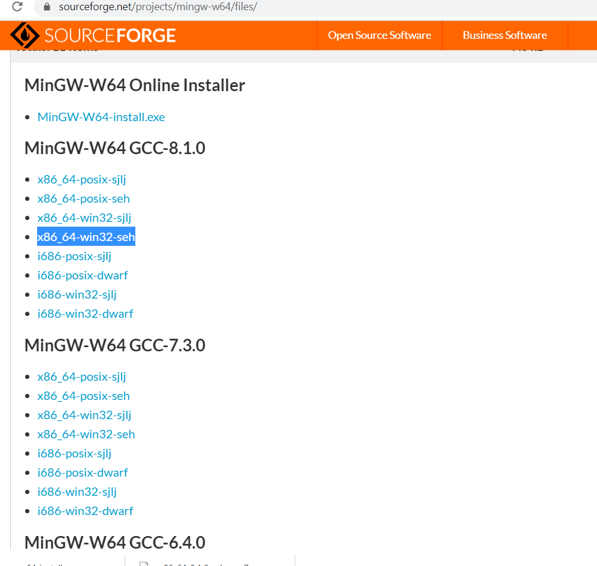

---
layout:       post
title:        Configuring C++17 supported  compiler on wnidows for CodeBlocks and Visual Studio Code 
subtitle:      Configuring C++17 supported  compiler on wnidows for CodeBlocks and Visual Studio Code 
date:         2020-02-28 15:40:00
author:       "xuepro"
header-img:   "img/home_bg.jpg"
header-mask:  0.3
catalog:      true
multilingual: true
tags:
    - c++    
---    

## 1.  install mingw-64 on windows

#### 1.1 download  mingw-64
goto download link to download the install program: [mingw-w64-install ](https://sourceforge.net/projects/mingw-w64/files/Toolchains%20targetting%20Win32/Personal%20Builds/mingw-builds/installer/mingw-w64-install.exe/download)

or download the mingW version [x86_64-win32-seh](https://sourceforge.net/projects/mingw-w64/files/)



#### 1.2 extracted the 7z compressed file to a foler using [7z](https://www.7-zip.org/download.html)

####  1.3  add the bin folder of mingw-64 to Windows PATH environment variable.

open a new Command Prompt and type:
```
g++ --version
gdb --version
```

#### 1.4 compile and run a c++ program 
use notepad++ or notepad  to edit a file "hello.cpp" as following:

```cpp
#include <array>
#include <iostream>
#include <string_view>
#include <tuple>
#include <type_traits>
 
namespace a::b::c
{
    inline constexpr std::string_view str{ "hello" };
}
 
template <class... T>
std::tuple<std::size_t, std::common_type_t<T...>> sum(T... args)
{
    return { sizeof...(T), (args + ...) };
}
 
int main()
{
    auto [iNumbers, iSum]{ sum(1, 2, 3) };
    std::cout << a::b::c::str << ' ' << iNumbers << ' ' << iSum << '\n';
 
    std::array arr{ 1, 2, 3 };
 
    std::cout << std::size(arr) << '\n';
 
    return 0;
}
```

in new Command Prompt and type:
```
g++ -std==c++17 hello.cpp -o hello.exe
hello.exe
```

## 2. cofigure CodeBlocks for mingW-64 C++ compiler

[CodeBlocks](http://www.codeblocks.org/)

from the main menu to select "**Settings** → **Compiler** →**Toolchain executables**. 

change from 


to 


from the main menu to select "**Settings** → **Compiler** →**compiler setting**. click the "**compiler flag**" and check the box 
"Have g++ follow the coming -std=c++1z  (aka C++17) ISO C++ language standard..."


Alternatively, you can go to the Other Compiler Options tab and type in -std=c++17.

##

 [https://code.visualstudio.com/](https://code.visualstudio.com/)

#### Refer to 

1. [https://code.visualstudio.com/docs/cpp/config-mingw](https://code.visualstudio.com/docs/cpp/config-mingw)
2. [Install Code::Blocks and GCC 9 on Windows - Build C, C++ and Fortran programs](https://solarianprogrammer.com/2019/11/16/install-codeblocks-gcc-windows-build-c-cpp-fortran-programs/)
3. [https://www.learncpp.com/cpp-tutorial/configuring-your-compiler-choosing-a-language-standard/](https://www.learncpp.com/cpp-tutorial/configuring-your-compiler-choosing-a-language-standard/)
